# Trần Đăng Khoa

### Automation · Embedded Systems · PCB Design · Robotics

Electrical engineering student at **UNETI**, building practical systems across hardware, firmware, automation, and software.

  
  
  
  

  
  

---

## GitHub overview

  
  

---

## About me

I enjoy engineering complete systems rather than isolated pieces:

> **Schematic & PCB → embedded firmware → communication → application software → testing & documentation**

I use GitHub as both a project workspace and an engineering notebook, keeping source code, hardware files, experiments, reports, and reusable tooling together whenever that improves traceability.

### Engineering focus

- **Embedded systems:** STM32, ESP32, Arduino, FreeRTOS and C/C++ firmware architecture.
- **Hardware and PCB:** schematic review, component selection, PCB layout and reusable Altium libraries.
- **Robotics and automation:** motor control, communication protocols, timeout protection and recovery logic.
- **Software engineering:** Python desktop tools, dashboards and testing applications.
- **AI and computer vision:** intelligent classification and workflow automation.

---

## Selected public engineering projects

Selected for technical depth, completeness, documentation quality, and relevance to embedded systems, control, PCB design, robotics, and engineering software.

### Embedded systems & control

  
  

  
  

### Robotics, hardware & PCB

  
  

### Software & developer tooling

  
  

---

## Technical toolbox

<picture>
  <source media="(max-width: 480px)" srcset="https://skillicons.dev/icons?i=c,cpp,python,kotlin,php,js,html,css,git,github,vscode,arduino&perline=4" />
  
</picture>

  

  
  
  
  
  
  
  
  

---

## Engineering principles

- **Understand the system:** interfaces, constraints, failure modes and actual operating conditions come first.
- **Design for verification:** logs, test points, reproducible builds and acceptance criteria reduce guesswork.
- **Prefer safe failure modes:** timeouts, validation, recovery paths and conservative assumptions are part of the design.
- **Measure before optimizing:** performance work should be based on evidence and documented decisions.

---

## Contact

  <a href="mailto:trandangkhoa.automation@gmail.com"><strong>Email</strong></a>
  ·
  <a href="https://github.com/TranDangKhoaAutomation"><strong>GitHub</strong></a>
  ·
  <a href="https://youtube.com/@TranDangKhoaTechnology"><strong>YouTube</strong></a>
  ·
  <a href="https://www.facebook.com/OfficialTranDangKhoa"><strong>Facebook</strong></a>

**Build the whole system. Verify every layer. Keep improving.**

Hardware · Firmware · Automation · Software

